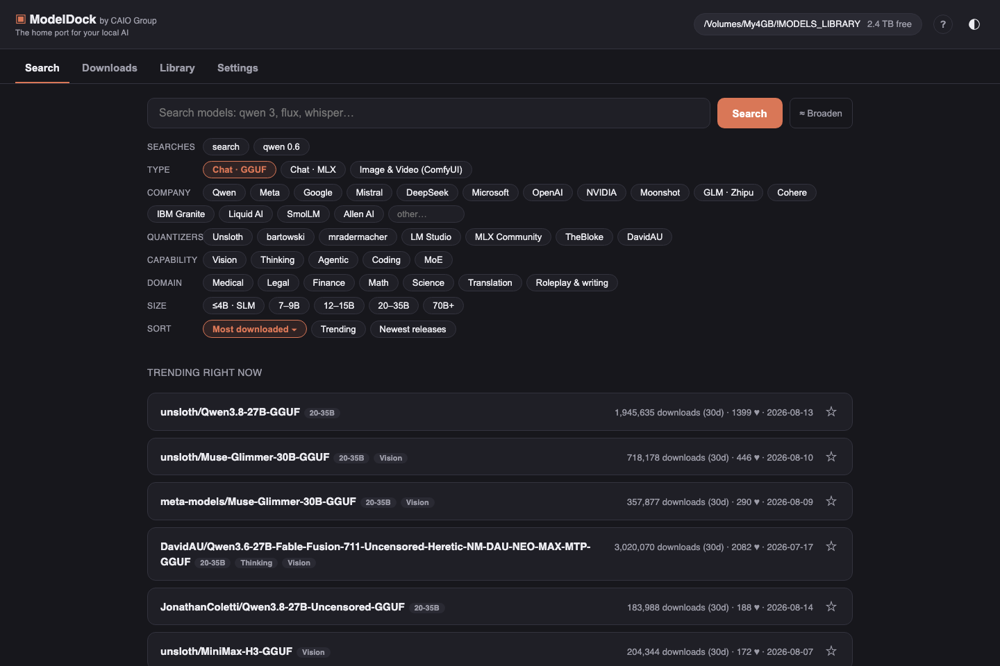
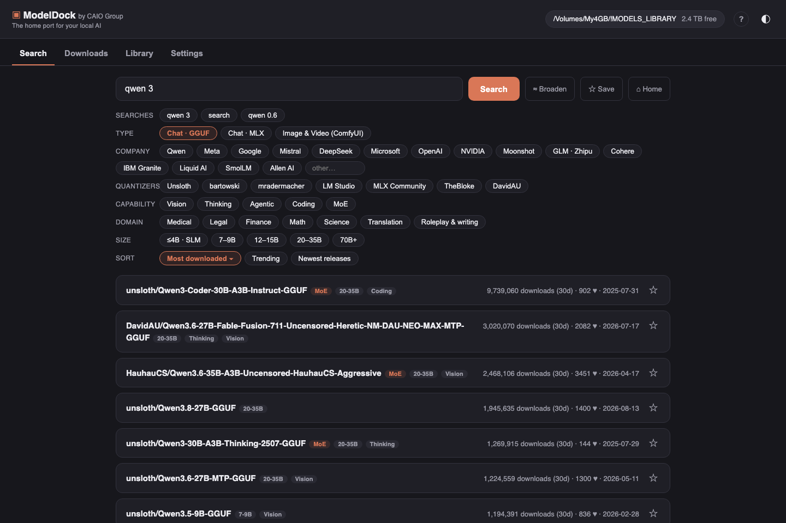
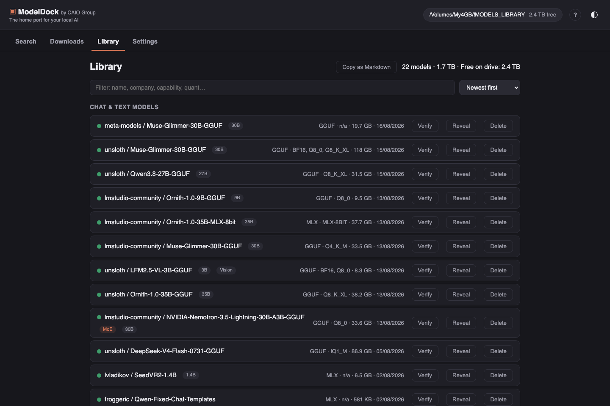
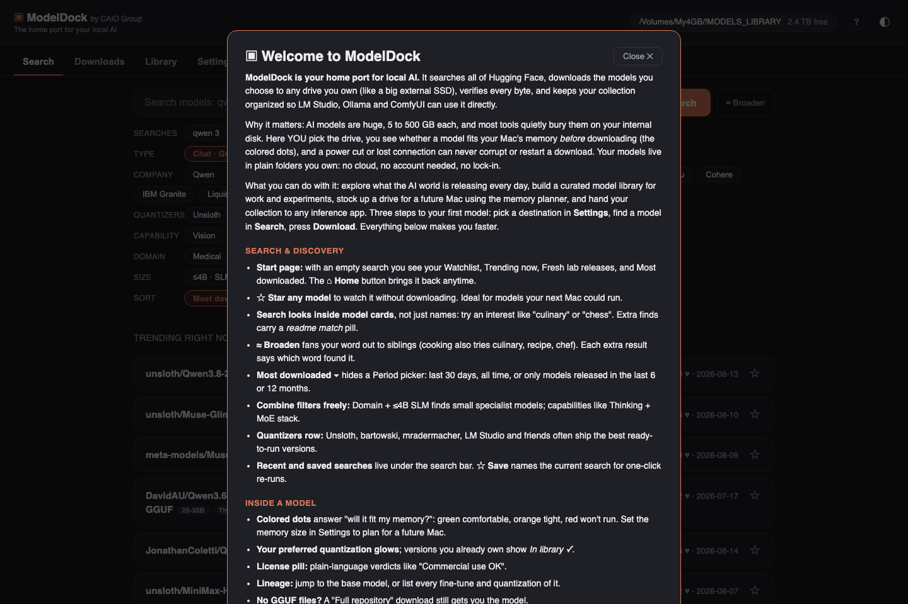

# ModelDock

<div align="center">

[](LICENSE)
[](#start)
[](#start)
[](https://huggingface.co)
[](https://wearecaio.com)
[](https://github.com/karagos/modeldock)

**The home port for your local AI.**

</div>

## What is ModelDock?

ModelDock is a local Mac app for building and managing your own collection of AI models. It searches all of Hugging Face, downloads the models you choose straight to any drive (typically a big external SSD), verifies every byte, and keeps your collection organized so inference apps like LM Studio, Ollama and ComfyUI can use it directly.

**The problem it solves:** local AI models are huge (5 GB to 500 GB each) and most tools quietly download them to your internal disk, in formats and folders you don't control. ModelDock puts you in charge: you pick the drive, you see exactly what fits your Mac's memory before downloading, downloads survive crashes and lost connections with byte-exact resume, and your models live in plain, portable folders you own. No cloud, no account required, no database. Everything runs on your machine.

**What it does, at a glance:**

- **Discover**: a start page with trending models, fresh lab releases and your watchlist; search that reads model names AND model card content, so interests like "culinary" or "legal" find specialist models; filters for company, quantizer, capability (Vision, Thinking, Agentic, Coding, MoE), knowledge domain, parameter size and time period; lineage buttons that reveal every fine-tune and quantization of any model.
- **Download**: resume-safe, checksum-verified transfers at any file size. Power cuts, crashes, sleep and broken connections only pause progress, never destroy it.
- **Organize**: a Library that reads the real drive, with capability badges, fits-your-memory dots, integrity verification, and one-click export of your collection as a Markdown table.
- **Plan**: a RAM selector shows what would run on a machine you don't own yet, so you can stock your drive before the new Mac arrives.

**Zero installation.** ModelDock runs on what macOS already ships. No Python installs, no packages, no accounts. Double-click one file and it opens in your browser.

## Screenshots

**The start page: trending models, fresh releases, your watchlist, and the full filter deck.**



**Search results with capability, size and MoE badges. Stars save models to your watchlist.**



**The Library: your collection with fits-your-memory dots, integrity Verify, and Markdown export.**



**The built-in guide (press ? anytime) explains every hidden gem.**



## Start

Double-click **`start.command`**. Your browser opens at `http://127.0.0.1:8420`. Close the Terminal window to stop the app.

## First-time setup (once)

1. Open the **Settings** tab.
2. Click **Choose folder…** and pick a folder on your external SSD (e.g. `T7/AI-Models`).
3. Done. The header always shows the current destination and its free space. Previous destinations appear as one-click chips, so switching between drives takes one click.

A built-in guide covers all of this: press the **?** button in the header (or the `?` key) anytime. It opens automatically on first launch.

## The four tabs

- **Search**: opens as a discovery feed (your Watchlist, Trending now, Fresh from the labs, Most downloaded) until you type. Star any model to watch it without downloading. Search matches model names AND model card content: interest words like "culinary", "chess" or "astronomy" surface specialist models whose names never mention them (marked with a "readme match" pill). Models without ready GGUF files offer a Full repository download. Every model's details include its lineage: jump to the base model, or list all fine-tunes and quantizations of it. A Broaden toggle fans your word out to siblings (cooking also searches culinary, recipe, chef), and your recent and saved searches sit one click under the search bar. Search Hugging Face with filters. Type (Chat GGUF, Chat MLX, Image & Video for ComfyUI; select several at once to see merged results with a format badge per model), company (major labs plus a dedicated Quantizers row: Unsloth, bartowski, mradermacher, LM Studio, MLX Community, TheBloke, DavidAU), capability (Vision, Thinking, Agentic, Coding, MoE, or Image/Video/LoRA/Upscaler; combine as many as you like), domain for specialist models (Medical, Legal, Finance, Math, Science, Translation, Roleplay & writing), parameter size (≤4B SLM … 70B+), sort, and a Period control for Most downloaded: last 30 days (Hugging Face's native counter), all time (true totals, re-ranked by ModelDock), or only models released in the last 6 or 12 months. Click a model to expand its details in place: description, Hugging Face link, and downloadable versions with exact sizes. The colored dot tells you how each file suits your chosen memory size: green runs comfortably, orange is tight, red won't fit. Your preferred quantization (Settings) is pre-highlighted, and versions you already own show "In library ✓". A license pill translates each model's license to plain language (Commercial use OK / Non-commercial / Custom).
- **Downloads**: progress, speed, time remaining, Pause / Resume / Cancel. Downloads run one at a time. Interruptions (sleep, network loss, unplugged drive, quitting the app) lose nothing: resume continues from the exact byte where it stopped. Refreshing or closing the browser page never interrupts a download; it runs in the app itself.
- **Library**: everything on the current destination with capability badges, fits-dots, sort and filter, **Verify** (re-checks a model against its recorded checksums), **Copy as Markdown** (paste-ready table for docs and posts), **Reveal in Finder**, and **Delete** (always to the Trash, never permanent).
- **Settings**: destination, preferred quantization (Q2 … BF16 and MLX 3/4/6/8-bit), theme, the color legend, and **Memory (RAM)**. The fits-badge normally uses this Mac's detected memory, but you can pick any size (8 GB to 512 GB) to plan downloads for a different machine, for example before buying a new Mac.

## Where files go

```
YourSSD/Models/
├── llm/                                ← chat models (LLMs)
│   └── Qwen/Qwen3-14B-GGUF/…gguf
└── comfyui/                            ← diffusion models (image & video)
    ├── checkpoints/  loras/  vae/  upscale_models/
```

- **LM Studio:** Settings → Models folder → point it at `YourSSD/Models/llm`. Everything ModelDock downloads appears automatically.
- **Ollama:** import a GGUF once with `ollama create <name> -f Modelfile` where the Modelfile contains `FROM /path/to/model.gguf`.
- **ComfyUI Desktop:** add `YourSSD/Models/comfyui` to extra model paths.

## Good to know

- Gated models (Meta Llama, Google Gemma, Flux dev) need a free Hugging Face account: paste a token in Settings and accept the model's license once on its page. Everything open (Qwen, DeepSeek, Mistral, community GGUFs, SDXL ecosystem…) works without any account.
- Every byte of every download is checksummed while it streams in, at any file size. A file is only given its real name after size and checksum verify, and the file is forced to physical disk first, so a power cut can never fake a "finished" model. Connection drops are waited out and resumed from the exact byte; a crash mid-download resumes automatically at next launch (with a safety margin re-downloaded). Checksums are recorded next to the files, so the Library's Verify button can re-prove integrity months later.
- Downloading a version you already have is refused with a clear message. Delete it in the Library first if you really want a fresh copy.
- The Library reads the actual drive every time. Files you move or delete in Finder are reflected immediately; there is no hidden database to go stale.

## Troubleshooting

| Problem | Fix |
|---|---|
| Browser shows nothing | Is the Terminal window still open? Double-click `start.command` again. If the app is already running it just reopens the browser. |
| "Drive not connected" in the header | Plug the SSD in; downloads resume, the Library comes back. |
| A download shows an error | Click Resume. It continues where it stopped. Persistent errors state the reason in plain language. |

## For maintenance sessions

- Tests: `/usr/bin/python3 -m unittest discover -s tests -v` (56 tests, no installs).
- Spec: `SPEC.md` · Plan: `specs/2026-07-30-modeldock-implementation-plan.md`.
- State: `data/state.json` (settings + download queue). Deleting it resets settings; it never contains models.
